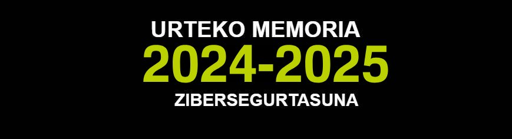
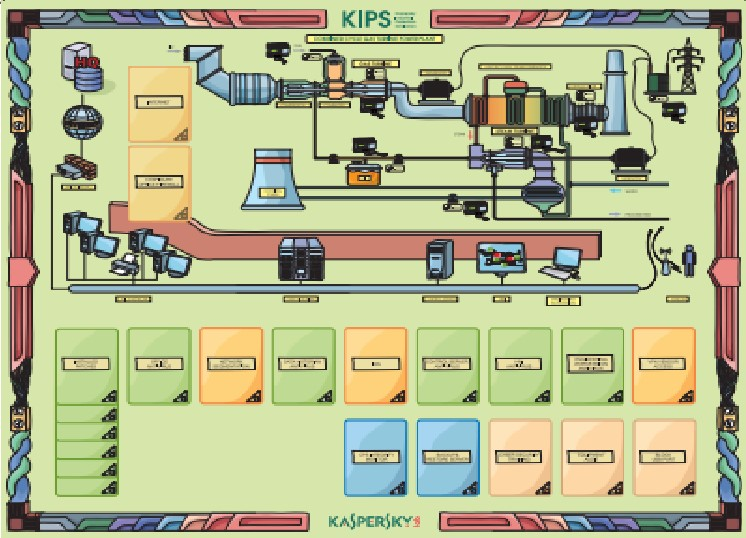

 <a href="https://github.com/Tknika/Zibersegurtasuna2024-2025/blob/main/README.md"</a>

  # Zibersegurtasuna2024-2025
**Tknikako Zibersegurtasun lan taldearen 2024 - 2025 kurtsoko memoria** 

Aurreko ikasturteetako memoriak ikusi nahi izanez gero (2022-2023) [hemen](https://github.com/Tknika/Zibersegurtasuna2022-2023) eta (2023-2024) [hemen](https://github.com/Tknika/Zibersegurtasuna2023-2024) aurkitu ditzakezu.
## Aurkibidea

- [Zibersegurtasuna 2024-2025](#zibersegurtasuna-2024-2025)
  - [Aurkibidea](#aurkibidea)
  - [1.Aurkezpena:](#1aurkezpena)
    - [1.1 Lan Taldea:](#11-lan-taldea)
  - [2.2025ko zifrak:](#22025ko-zifrak)
  - [3.Lan ildoak:](#3lan-ildoak)
    - [3.1 Lanketa teorikoak:](#31-lanketa-teorikoak)
    - [3.2 Pilotuak:](#32-pilotuak)
    - [3.3 Ikastaroak:](#33-ikastaroak)
    - [3.4 Zentruetako proiektuak:](#34-zentru-proiektuak)
    - [3.5 Jardunaldiak:](#35-jardunaldiak)
    - [3.6 Txapelketak eta CR Saioak:](#36-txapelketak-eta-cr-saioak)
  -----------------------------------------------------------------------------------------------
## 1.Aurkezpena:
2024-25 ikasturtean zehar **Tknikako Zibersegurtasun** lantaldean jorratu diren edukiak agertzen dira jarraian. Edukiak zerrendatzeaz gain, erabilitako fitxategi edo sorturiko materialetara iristeko estekak ere badaude. 
### 1.1 Lan Taldea:
Kurtso honetan lan taldea osatu duten partaideak izan dira:

   - Garikoitz Etxeberria 
   - Paulino Insausti
   - Urko Zuñiga
   - Xabat Zabala
   - Ibai Peña

## 2.2025ko zifrak:

## 3.Lan ildoak:

### 3.1 Lanketa teorikoak:

#### 3.1.1. Enisa vs DCB:
[ENISA](https://www.enisa.europa.eu/) (European Union Agency for Cybersecurity) Europar Batasuneko zibersegurtasunaren agentzia da; haren helburuak estatu kideen zibersegurtasuna sendotzea, politika publikoak babestea eta arriskuen aurrean aholku teknikoak ematea dira. ENISAk 2022an  [ECSF](https://www.enisa.europa.eu/publications/european-cybersecurity-skills-framework-role-profiles) (European Cybersecurity Skills Framework) markoa garatu zuen; marko horrek zibersegurtasunaren arloko lanpostuak, eginkizunak eta beharrezko gaitasunak sailkatu eta estandarizatzen ditu. Haren bidez, enpresek, hezkuntza-erakundeek eta profesionalek hobeto uler ditzakete zein lanbide-profil dauden eta bakoitzak zer trebetasun eskatzen dituen. Euskadiko Lanbide Heziketan bi espezializazio-ikastaro ditugu zibersegurtasunaren inguruan: [*Informazioaren Teknologien Inguruneetan Zibersegurtasuneko Espezializazio-Ikastaroa*](https://ivac-eei.eus/eu/lanbide-arloak/informatika-eta-komunikazioak-ifc/espezializazioak/informazioaren-teknologien-inguruneetan-zibersegurtasuneko-espezializazio-ikastaroa.html) eta [*Eragiketa-Teknologien Inguruneetan Zibersegurtasuneko Espezializazio-Ikastaroa*](https://ivac-eei.eus/eu/lanbide-arloak/elektrizitatea-eta-elektronika-ele/espezializazioak/eragiketa-teknologien-inguruneetan-zibersegurtasuneko-espezializazio-ikastaroa.html) 

Azken urteotan, bi ikastaro horien hazkundea itzela izan da, eta garrantzitsua iruditu zaigu haien dekretuak ECSF delakoarekin sakonean alderatzea, ikusteko zer neurritan eusten dieten gure gaitegiek ENISAk proposatutako profilen nondik norakoei. Behin ikerketa hori gauzatuta, [txosten bat](lanketa_teorikoa/enisa_txostena) egin dugu ateratako ondorio guztiak jasotzeko. 

### 3.2 Pilotuak:

#### 3.2.1 Pentesting Pilotua:
Hirugarren urtez jarraian, zibersegurtasun espezialitatea ikasi duen ikasle bat bidali digu zibersegurtasun enpresa batean bere DUAL-a egitera, eta helburu bezela ikastetxe baten pentesting-a egitea ezarri diogu:

- Ikaslea: Aitor Santos
- Ikaslearen zentrua: Maristak Durango
- Enpresa: JakinCode
- Pentesting-a jaso duen LH-ko Ikastetxea: [AEGI](https://eagi.eus/)

#### 3.2.3 Wifi Gotortzea:

Proiektu honek ikastetxeentzako WiFi eredu segurua proposatzen du, konektibitatea, ikasleen eta irakasleen babesa arriskuan jarri gabe. Ikastetxe-sareetako ahultasun komunak aztertzen dira, eta zifratze sendoan oinarritutako babes neurriak. Sarearen segmentazioa, autentifikazio aurreratua eta edukiak iragazteko tresnak erakutsiz.

### 3.3 Ikastaroak:

#### 3.3.1. ER/DEF CTF plataforman erabiltzeko ERRONKAK garatzeko ikastaroa

Gure Eraso Defentsarako plataforman erabili ahal izateko erronkak nola sortu azaldu da, azpiegituraren oinarri batzuk azaltzeaz gain eta ariketa bezala erronka baten garapena proposatu zaie.

Ondokoa izan da hiruna ordutako bi saioetan landutako:

    1. Saioa

        Sarrera (15 min)

        TKnikak garatuta ER/DEF CTF Plantaformaren azalpenak (90 min)

            Osagai ezberdinak azaldu

            Leihaketa martxan jarri eta probatu

        Partehatzaile bakoitzak bere erronkaren egitura (brach berri batean) sortu eta ingurunea prestatu (20 min)

        Zerbitzuen despliequea erakutsi (10 min)

        Zerbitzu baten despliegea egin (15 min)

    2. Saioa

        Zerbitzuen egituraren azalpena (ordu 1)

        Checkerren egituraren azalpena (ordu 1)

        Zerbitzu baten garapena (ordu 1)

Bakoitzak bere errenkoa lantzeko 24 ordu asinkrono izan ditu, tartean aukeran eskaini diren hiru tutoretza saioetan zalantzak argitua ahal izan dituztelarik.

26 partehartzaile izan dira ikastaroan eta hauetatik 15ek bukatu dute ikastaroa, horietatik 14k gainditu duelarik. Bukatu ez dutenek, datekin arazoak izana aipatu dute batez ere.

#### 3.3.2. Urruneko sarbideak OT inguruneetan 

Urruneko sarbideei buruzko kontzeptuak, definizioak eta azalpenak landu dira. Horrek prestakuntzaren alderdi teorikoa lantzeko balio du, besteak beste, honako eduki hauek:

1. Beharrak eta arrazoiak.
2. Aplikazioak agertokien arabera.
3. Arazoak, konponbideak eta mugak.
4. Erabilitako teknologiak, softwarea eta hardwarea.
5. Komunikazioetan segurtasuna bermatzeko neurriak.
6. Arkitekturak.

Alderdi praktikoan hainbat jarduera mota planteatuko ziren. Horretarako, fabrikatzaile hauen ekipamendua erabili zen:

1. Siemens
2. Fortinet.
3. eWon.
4. Phoenix Contact.

Ikastaroan erabilitako [Dokumentazio Gida](docs/Presentación_OT.pdf) eta materiala [Ikastaroko materiala](materiala/Guiones%20prácticas/)

#### 3.3.3. OT Ingurune Birtualen Lanketa

Ekaineko lehen hamabostaldian eskeinitako ikastaro honetan 15 irakasle inguru elkartu ziren, OT laborategiak 3D inguruneetan montatzeko dauden aukera desberdinak aztertzeko.
Gailu industrial fisikoak erabili gabe laborategi birtualak montatzeko dauden teknologia edo inguruneak ikusi ziren. GRFICS proiektua, Factory Io, Codesys...moduko softwareak elkarlotuz, ingurune industrial birtualak sortuz. Bukaeran, gailu fisikoak ingurune hauetara lotzeko dauden aukerak ere landu ziren. PLC, sentsore, aktuatzaile, HMI/SCADA...teknologiak barnebilduz.

Ikastaroan erabilitako [Dokumentazio Gida](ikastaroak/OT_3D_LabBirtualak)

### 3.4 Zentru Proiektuak:

#### 3.4.1 ZiberHub:
Txurdinaga LHII, Uni Eibar eta Zubiri Manteo BHI ikastetxeen arteko lankidetza proiektu batetan, Ziberhub izeneko proiektu bat landu da elkarlanean. Proiektu honen helburua, CTF (Capture The Flag) motako plataforma bat hedatzea izan da. Batipat, Zibersegurtasunaren arloa jorratzen den ikastetxeetan erronka propioak hedatu eta behar denerako eskuragarri izateko.
IsardVDI plataforma erabili da honetarako eta malgutasun haundia eskeintzen du, erronka propioak sortu eta baita ere, gainontzeko ikastetxeetako iarakasleekin berauek partekatzeko.

Proiektuan erabilitako [Dokumentazio Gida](docs/Ziberhubmurriztua.pptx)

#### 3.4.2 Laudioalde digitalizazio segurua:
Laudioalde LH-rekin elkarlanean 4.0 tailler bat moldatzeko eginiko zentru proiektuaren informazioa aurkituko duzue [esteka](docs/Tknika_4.0Tailerra_aurkezpena.pptx) honetan. Aurkezpen honetan, proiektu hau garatzeko jarraitutako urratsen informazioa aurkituko duzue.

### 3.5 Jardunaldiak:

#### 3.5.1 OT Ziberintzidente baten simulazioa:

ZIURen eskutik, Kaspersky Interactive Protection Simulation (KIPS) tresna ezagutzeko aukera izan zen, OT zibersegurtasunaren simulazioan parte hartzeko aukera emanez. Saio honen helburua datorren ikasturtean ikasleekin egin nahi diren saioak baloratzeko tresna probatzea izan zen.

#### 3.5.2. Zibersegurtasun Jardunaldia - 2025 Ekainak 24

Beste urte batez, Zibersegurtasun espezialitatea igortzen den ikastetxeetako irakasle guztiei gonbitea luzatu zitzaien ikasturte amaierako jardunaldi honetan parte hartzeko. 

Bertan landu zen PROGRAMA honakoa izan zen:

  - 09:00 – 09:15: Ongietorri eta aurkezpenak
  - 09:15 – 09:30: Tknikako zibersegurtasun alorraren edukien errepasoa. LH-ko beste eduki interesgarriak.
  - 09:30 – 10:00: CyberLehia planteamendua. OT Inzidente kasuaren azalpena.
  - 10:00 – 10:30: ZiberHub zentru proiektuaren azalpena
  - 10:30 – 11:00: Laudioalde proiektu saridunaren aurkezpena
  - 11:00 – 11:30: Atseden tartea
  - 11:30 – 12:30: TryHackMe plataforma. Esperientziak partekatu
  - 12:30 – 13:30: Moduloka/Ikasgaika biltzea, esperientziak, zailtasunak eta zalantzak partekatzeko

  Jardunaldian erabilitako [Aurkezpena](docs/ZibersegurtasunJardunaldia2025Ekainak24_1.pptx) eta landutako [Edukiak](docs/ZibersegurtasunJardunaldia2025Ekainak24_2.pptx)

### 3.6 Txapelketak eta CR Saioak:

#### 3.6.1 CyberLehia

Eusko Jaurlaritzako Hezkuntza Saileko Lanbide Heziketako Sailburuordetzak antolatutako zibersegurtasun lehiaketa da CyberLehia. 2025ekoa bigarren edizioa izan da, eta Euskadiko Lanbide Heziketako zentru integratuei dago zuzendua.

Txapelketaren fase ezberdinetan 463 ikaslek parte-hartu dute, 30 zentru ezberdinen ordezkari gisa. Aurreko urtearekin konparatuz, (280, 25) hazkunde handia izan du parte-hartzeak.
Txapelketa taldekakoa izan da, talde bakoitzak gehienez 3 partaide izan zitzakeen.

Aurtengo txapelketaren helburua zibersegurtasunaz dakitenek partehartzeaz gain, jakinmiña zutenek ere partehartzea izan da. Horretarako proposatutako erronka kopurua asko handitu da, eta erronka horietako portzentai handi bat zailtasun maila oso errezekoak izan dira, jakinmina zutenek ere gainditzeko modukoak. Eta partehartze datuek erakusten digu amuak funtzionatu duela.

**Txapelketaren webgunea:**
https://cyberlehia.fpeuskadi.eus/

**Aurreko urteko edizioaren laburpen bideoa:**
https://www.youtube.com/watch?v=2AtvKaG9ahY

**2025 edizioko eduki gehiago:**
https://cyberlehia.fpeuskadi.eus/aurreko-edizioak/2025-edizioa/

**Txapelketako faseak:**

**1- Fasea:** Otsailan egin zen, online modalidadean, taldeei gai eta eduki ezberdineko 60 erronka baino gehiago proposatu zitzaizkien eta bost eguneko epean ahalik eta erronka gehien ebaztea zen helburua. 
		
33 talde onenek hurrengo faserako txartela lortu zuten.

**2- Fasea:** Martxoan burutu zen, online modalidadean. Aurreko fasean bezela, gai eta eduki ezberdineko 49 erronka proposatu zitzaizkien eta astebeteko epean ahalik eta erronka gehien ebaztea zen helburua. 

5 talde onenek finalera sailkatzea lortu zuten.

**Azken Fasea eta Finala:**

Aurten azken fasea bi probatan banatzea erabaki da:

Ariketa teorikoa: Enpresa batean gertaturiko zibersegurtasun arazo bati buruzko ariketa teoriko bat egin behar dute. Ariketa hau berria da, eta txapelketan txertatu dugu, zibersegurtasun enpresetatik jasotako gomendioei jarraituz. Izan ere, beraien esanetan ikasleek hobetzeko duten esparru nagusia horrelako txostenak egitean datza. 

**Ariketa praktikoa-Finala:** Aurreko urtean bezela, Eraso/Defentsa motako CTF batean parte hartu behar izan dute, Apirilak 3an jokatuko den Zorrozaurreko La Terminal aretoan, presentzialki.

Azken faseko bigarren proba honetan, aurreko urtean bezala, finalistek eraso defentsa ariketa batean parte hartu behar izan zuen, 6 erronkatan beraien defentsa eta erasorako gaitasunak erakutsiz.

Finaleko bi probak burutu ostean, ondokoak izan ziren proba bakoitzean lortutako puntuazioak eta azken sailkapena:

#### 3.6.2 ER/DEF SEIM

Martxoaren 20an, SEIM ikastetxetik etorritako ikasleekin Eraso Defentsa ariketa bat egin genuen TKnikan egokitutako azpiegituran. 

#### 3.6.3 ER/DEF saioa irakasleentzat

Cyberlehia 2025eko finalean erabilitako plataforma Zibersegurtasun espezialitateko irakasleei frogatzeko aukera eman zitzaien Ekainak 24an burutu zen saioan. Bertan, jolas modura planteaturiko gaitasun desberdinetan trebatzeko aukera eman zitzaien parte hartu zuten irakasleei.

